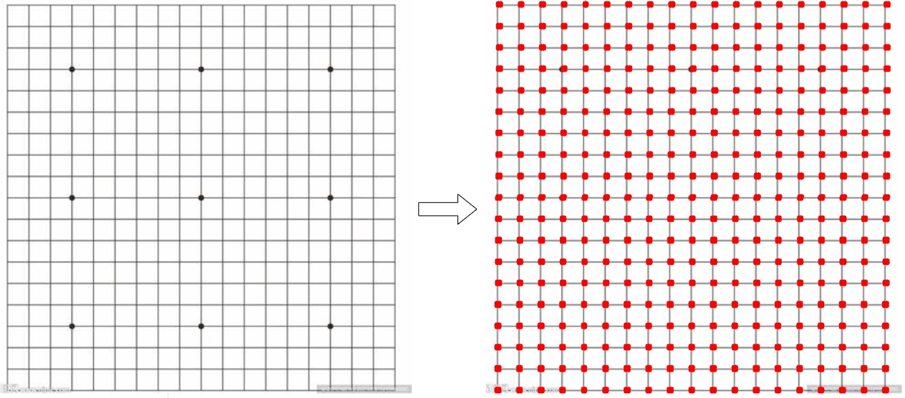
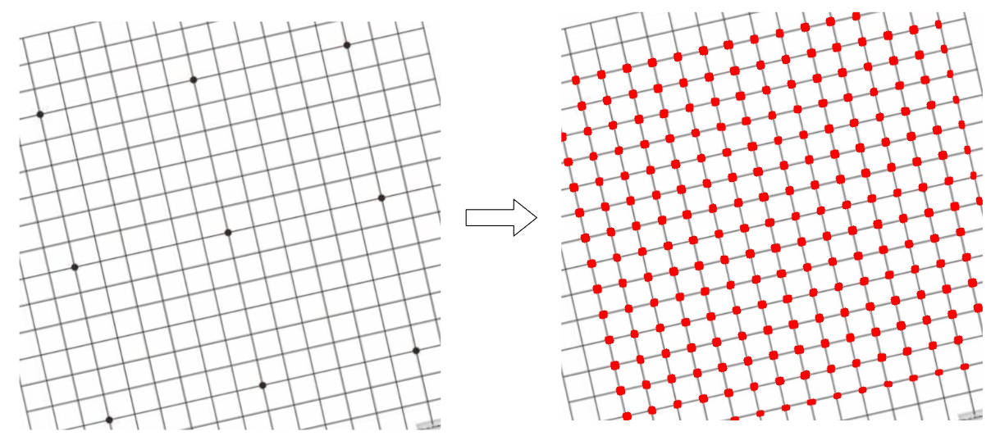

# 说明

对于一个含有多个相邻四边形的图片，给出一个基于opencv的方案，可以定位出其中的四边形的顶点。

原博客-[基于Open-CV的多四边形检测方案](https://blog.csdn.net/m0_54414158/article/details/143524323?fromshare=blogdetail&sharetype=blogdetail&sharerId=143524323&sharerefer=PC&sharesource=m0_54414158&sharefrom=from_link)





# 软件版本

```bash
Python==3.9
opencv-python==4.10.0.84
numpy==1.22.4
```

# 使用方式

将需要处理的图片放到`.\source_img`目录下，运行main.py文件后，处理结果会保存至`.\output_dir`目录下

# 提示

对于分辨率过高的图片，可以使用Canny算子处理后会得到过多的边缘，这些边缘对检测无用，建议使用lower_the_resolution.py降低分辨率后再处理。lower_the_resolution.py输出至`.\source_img_low_resolution`

